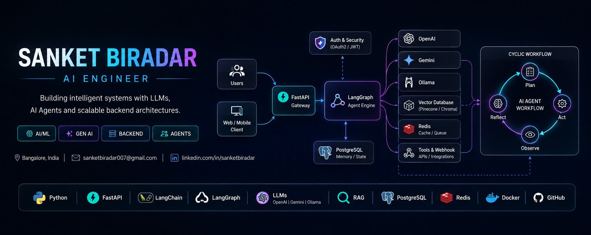

<div align="center">



# SANKET BIRADAR

### AI Engineer | GenAI Engineer

Building production-ready Generative AI and backend systems with Python, FastAPI, LLMs and AI Agents.

<p>
<a href="https://github.com/SanketBiradar017">

</a>
<a href="https://www.linkedin.com/in/sanket_biradar">

</a>
<a href="mailto:sanketbiradar007@gmail.com">

</a>
</p>

📍 Bangalore, India

</div>

---

## 👨‍💻 Professional Summary

AI/GenAI Engineer with **experience in** building and deploying production-grade Generative AI and backend systems using **Python and FastAPI**.

Hands-on experience developing **RAG pipelines, LLM applications, LangChain, LangGraph, multi-agent systems, agent orchestration, and vector search solutions**.

Experienced in designing **scalable asynchronous APIs, real-time AI applications, background processing, caching, and cloud deployments on Google Cloud Platform (GCP)**.

Strong focus on **LLM orchestration, backend architecture, performance optimization, and production-ready AI systems**.

---

## 🧠 Core Skills

### 💻 Programming

<p>

</p>

### ⚡ Backend Engineering

<p>


</p>

### 🤖 Generative AI

<p>


</p>

### 🔗 AI Frameworks

<p>


</p>

### 🧠 Agent Systems

<p>


</p>

### 🗄️ Databases & Performance

<p>


</p>

**Also:** Vector Databases • Background Jobs • Caching • Async Processing

### ☁️ Cloud & Deployment

<p>

</p>

### 📐 Architecture

**Scalable Systems • Microservices • API Architecture • RAG Pipelines**

### 📊 Libraries & Developer Tools

<p>


</p>

---

# 🧠 AI Engineering Architecture

```text
                              ┌─────────────────┐
                              │      USERS      │
                              └────────┬────────┘
                                       │
                                       ▼
                              ┌─────────────────┐
                              │     FastAPI     │
                              │     Gateway     │
                              └────────┬────────┘
                                       │
                                       ▼
                              ┌─────────────────┐
                              │    LangGraph    │
                              │  Agent Engine   │
                              └────────┬────────┘
                                       │
                  ┌────────────────────┼────────────────────┐
                  │                    │                    │
                  ▼                    ▼                    ▼
           ┌─────────────┐      ┌─────────────┐      ┌─────────────┐
           │    LLMs     │      │   RAG /     │      │  PostgreSQL │
           │             │      │ Vector DB   │      │   / MySQL   │
           │ OpenAI      │      │             │      │             │
           │ Gemini      │      │ Retrieval   │      │ State/Data  │
           │ Ollama      │      │ Embeddings  │      │             │
           └─────────────┘      └─────────────┘      └─────────────┘
                  │
                  ▼
           ┌─────────────┐
           │    Redis    │
           │ Cache/Queue │
           └─────────────┘
                  │
                  ▼
           ┌─────────────┐
           │   Celery    │
           │ Background  │
           │    Jobs     │
           └─────────────┘
